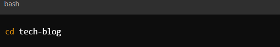
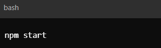

# Tech-Blog

## Table of Contents

 - Description
 - Key Features
 - Installation and Usage
 - Contributions
 - Testing and Links
 - Resources
 - License 

## Description
Tech Blog is a dynamic platform where developers can publish their own blog posts, engage with others' content, and discuss various topics in the tech industry. Users can create posts, comment on others' posts, and manage their own dashboard for a personalized experience.

## Key Features: 
- Publish Posts: Write and share your own blog posts on a range of topics including coding practices, new technologies, project experiences, and industry trends. Our easy-to-use editor allows you to format your content, add code snippets, and make your articles visually engaging.

 - Engage with the Community: Read and comment on posts from other developers. Share your thoughts, ask questions, and participate in discussions to gain new perspectives and deepen your understanding of different technologies and techniques.

 - Interactive Discussions: Our comment system fosters meaningful interactions. Connect with other developers, provide constructive feedback, and collaborate on ideas directly within the blog's ecosystem.

 - User Profiles and Dashboards: Manage your contributions and track your interactions through personalized dashboards. Keep an eye on your published content, comments, and feedback from fellow tech enthusiasts.

 ## Installation and Usage
Follow these steps to get your development environment set up:

1. Clone the repository

2. Navigate to the Project Directory 

3. Install Dependencies such as npm install

4. Run the application 

## Contributions

Feel free to contribute to the Tech Blog project. Here are a few ways you can help:

Report Issues: If you find bugs or issues, please open an issue on the GitHub repository.
Submit Pull Requests: If you have improvements or new features, submit a pull request with your changes.

## Testing and Links

Repository Link: https://github.com/Alondra1752/Tech-Blog

Deployment Link: https://alondra1752.github.io/Tech-Blog/

## Resources 

ChatGPT, W3 Schools, Classroom activities and videos, TA's and students who helped me with this project! 

## License 

This project is licensed under MIT License. For more information please click on the badge below: 

 

